# Fullstack URL Shortener Discord Bot

This Discord bot is similar to bit.ly that allows users to shorten URLs and perform various other actions related to URL management and analytics directly from Discord.

- Backend URL: <https://url-shortener-server-0urk.onrender.com/api/docs/>
- Discord Bot Link (in progress): <https://discord.com/oauth2/authorize?client_id=1239186440387035187>

## Features

- Reusable Backend: Backend is built with Express.js so it can be used by web, app, or anything.
- Slash Commands: Utilizes Discord's slash commands for easy interaction, all via discord bot.
- Shorten URLs: Users can shorten long URLs to short ones.
- Authentication: Provides user registration, login, and token refresh functionalities.
- Profile Management: Users can update their profile information.
- Data Analytics: Allows users to view analytics for shortened URLs.

## Screenshots
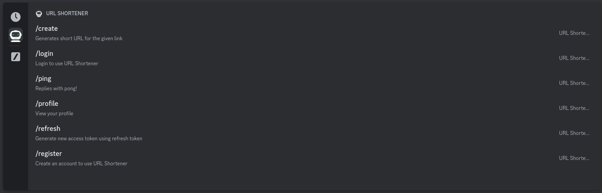
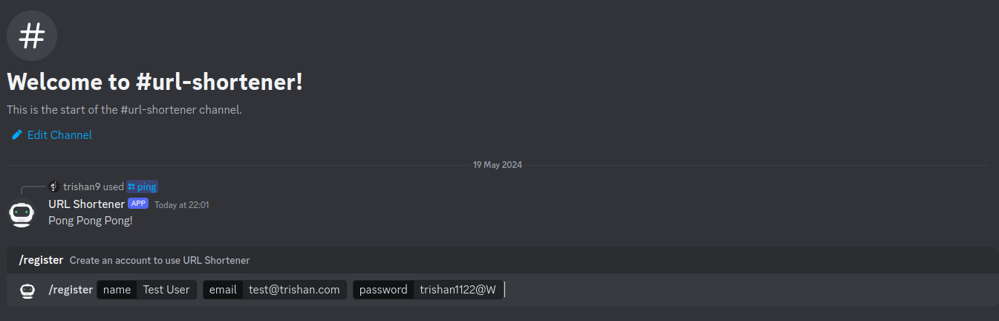
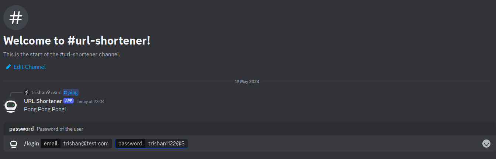
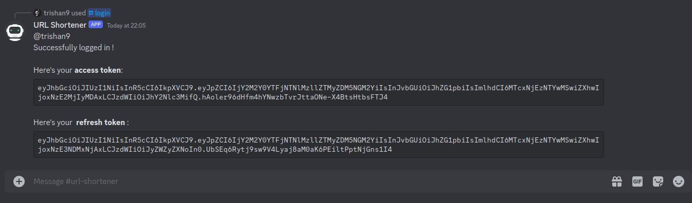
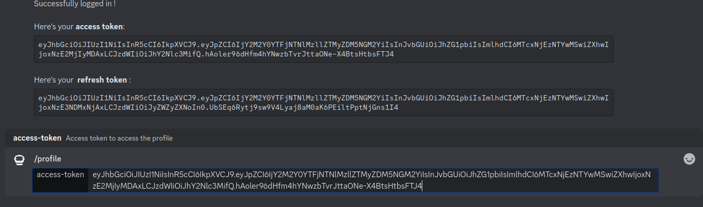
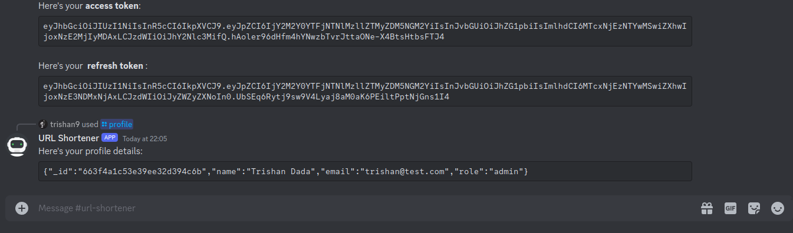
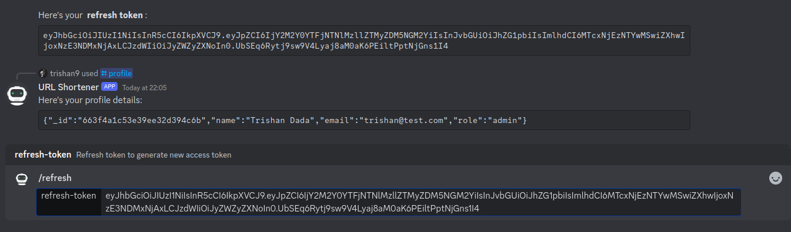
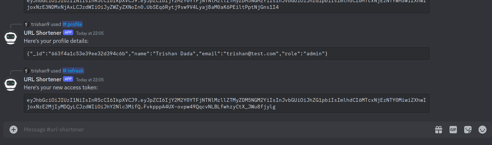
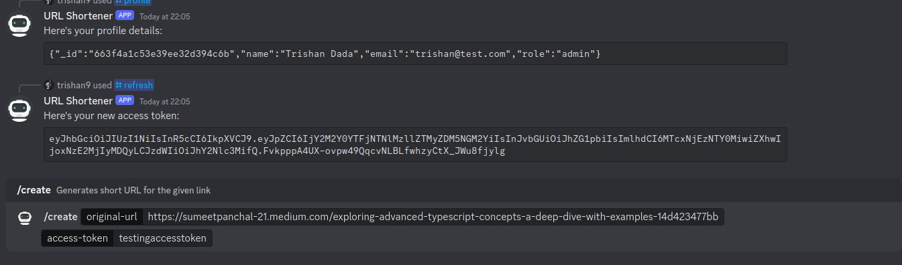
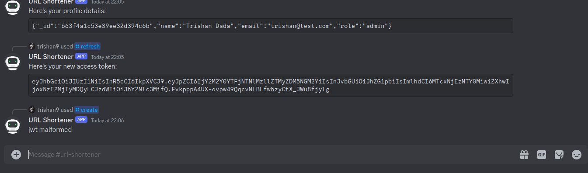
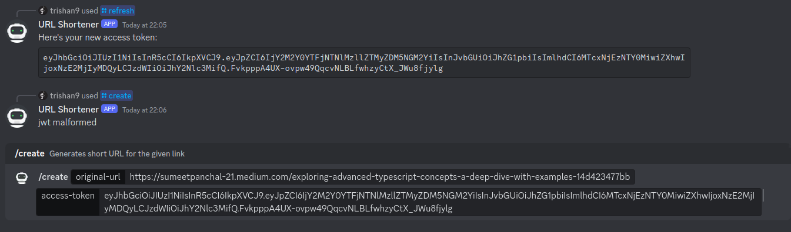
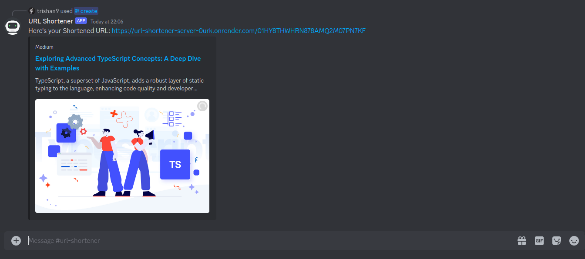
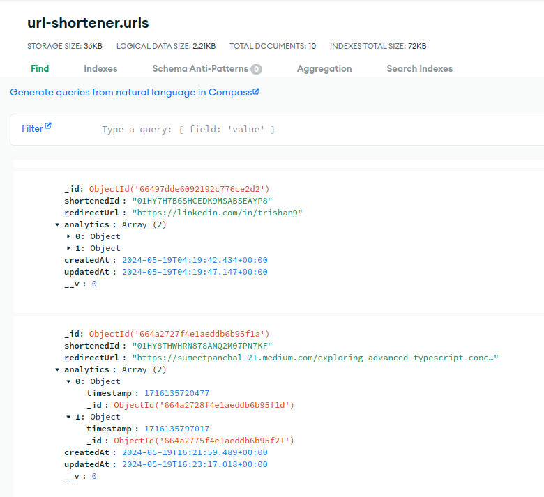
